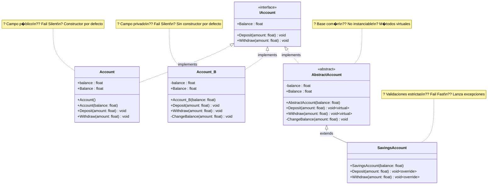
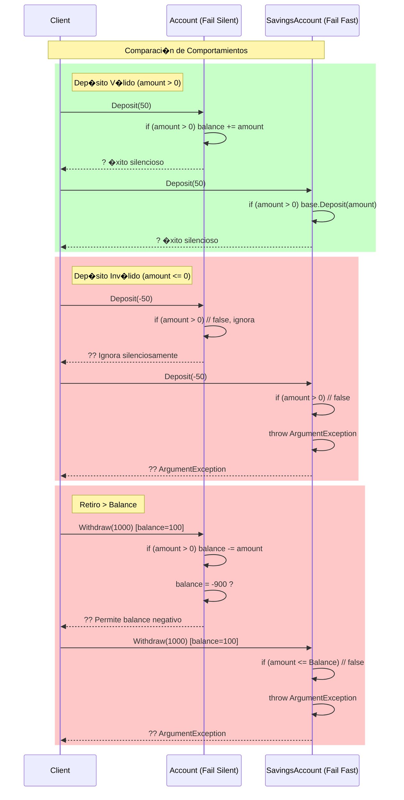
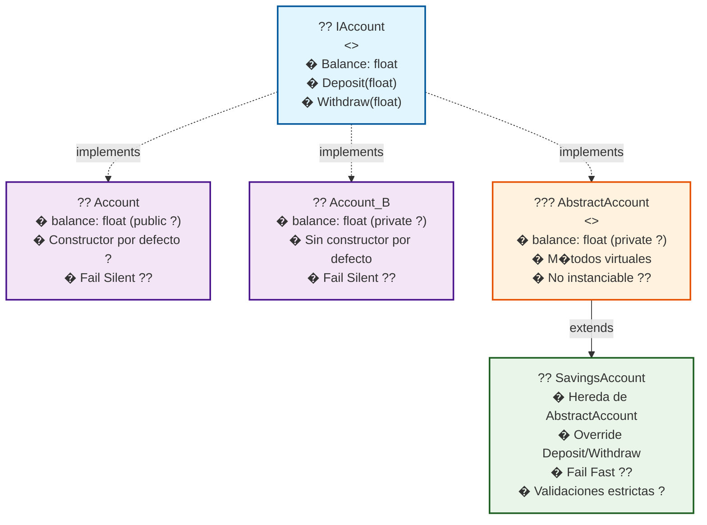
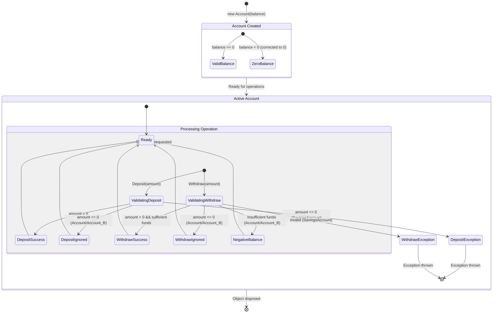

# TDD y OOP en C# - Proyecto de Ejemplo para Taller Parcial

Este proyecto demuestra los conceptos fundamentales de **Test-Driven Development (TDD)** y **Object-Oriented Programming (OOP)** en C# usando NUnit como framework de testing. Fue creado como material de estudio para el **Taller Parcial 2** de la materia de Scripting.

## ?? �ndice

- [Estructura del Proyecto](#estructura-del-proyecto)
- [Diagramas UML](#diagramas-uml)
- [Conceptos de TDD](#conceptos-de-tdd)
- [Conceptos de OOP](#conceptos-de-oop)
- [An�lisis Detallado de Clases](#an�lisis-detallado-de-clases)
- [An�lisis de Tests](#an�lisis-de-tests)
- [Diferencias entre Implementaciones](#diferencias-entre-implementaciones)
- [Patrones y Best Practices](#patrones-y-best-practices)
- [Casos de Prueba Cr�ticos](#casos-de-prueba-cr�ticos)

## ?? Estructura del Proyecto

```
IDED_Scripting_TDD_Proj/
??? Source/
?   ??? IAccount.cs          # ?? Interfaz base - Contrato
?   ??? Account.cs           # ?? Implementaci�n b�sica
?   ??? Account_B.cs         # ?? Implementaci�n alternativa
?   ??? AbstractAccount.cs   # ??? Clase abstracta base
?   ??? SavingsAccount.cs    # ?? Cuenta de ahorros (herencia + validaciones)
??? UnitTest1.cs            # ?? Tests b�sicos de implementaciones
??? TestAbstractClass.cs    # ?? Tests de herencia y excepciones
??? README.md               # ?? Esta documentaci�n
```

## ??? Diagramas UML

### Diagrama de Clases - Arquitectura Completa



### Diagrama de Secuencia - Flujo de Operaciones



### Diagrama de Herencia - Jerarqu�a de Clases



### Diagrama de Estados - Ciclo de Vida de una Cuenta



## ?? Conceptos de TDD

### 1. Atributos Esenciales de NUnit

```csharp
[TestFixture]  // ??? Marca la clase como contenedor de tests
public class Tests
{
    [Test]         // ? Marca m�todos individuales como tests
    [TestCase(0F)] // ?? Permite tests parametrizados (m�ltiples valores)
    [SetUp]        // ?? Se ejecuta ANTES de cada test
    [TearDown]     // ?? Se ejecuta DESPU�S de cada test
}
```

### 2. Tipos de Assertions (Verificaciones)

```csharp
// ? Comparaci�n directa (menos legible)
Assert.That(account.Balance == 100);

// ? Fluent syntax (M�S LEGIBLE - RECOMENDADO)
Assert.That(account.Balance, Is.AtLeast(0));

// ? Verificar que NO lance excepci�n
Assert.DoesNotThrow(() => account.Deposit(50));

// ? Verificar excepci�n espec�fica (CR�TICO para validaciones)
Assert.Throws<ArgumentException>(() => account.Withdraw(-1));

// ? Control manual de resultados
Assert.Fail();   // Fuerza fallo del test
Assert.Pass();   // Fuerza �xito del test

// ? Sintaxis obsoleta (evitar)
Assert.GreaterOrEqual(0, account.Balance);
```

### 3. Tests Parametrizados (Data-Driven Tests)

```csharp
[TestCase(0F)]     // ?? Valor l�mite: cero
[TestCase(100F)]   // ?? Valor normal positivo
[TestCase(2F)]     // ?? Valor peque�o positivo
[TestCase(-10F)]   // ?? Valor negativo (caso l�mite)
public void TestCreateAccountParameter(float balance)
{
    IAccount account = new Account_B(balance);
    
    // ? Verificar que el balance nunca sea negativo
    Assert.That(account.Balance, Is.AtLeast(0));
}
```

### 4. Patr�n SetUp/TearDown - Gesti�n de Estado

```csharp
[TestFixture]
public class TestAbstractClass
{
    private SavingsAccount accountS;  // ?? Estado compartido

    [SetUp]
    public void Setup()
    {
        // ?? Preparaci�n: se ejecuta antes de CADA test
        accountS = new SavingsAccount(0F);
    }

    [TearDown] 
    public void TearDown()
    {
        // ?? Limpieza: se ejecuta despu�s de CADA test
        accountS = null;
    }
}
```

## ??? Conceptos de OOP

### 1. Interfaz (`IAccount`) - El Contrato

```csharp
internal interface IAccount
{
    float Balance { get; }        // ?? Propiedad de solo lectura
    void Deposit(float amount);   // ?? M�todo para depositar
    void Withdraw(float amount);  // ?? M�todo para retirar
}
```

**Principios aplicados:**
- ? **Abstracci�n**: Define QU� se puede hacer, no C�MO
- ? **Contrato**: Todas las implementaciones deben cumplirlo
- ? **Polimorfismo**: `IAccount account = new SavingsAccount(100)`

### 2. Implementaci�n Directa (`Account`)

```csharp
internal class Account : IAccount
{
    public float balance;  // ? Campo p�blico (mala pr�ctica)

    // Constructor por defecto (balance = 100)
    public Account() => balance = 100;

    // Constructor con validaci�n b�sica
    public Account(float balance)
    {
        this.balance = balance < 0 ? 0 : balance;
    }

    public float Balance => balance;  // Property con expression body

    public void Deposit(float amount)
    {
        if (amount > 0) balance += amount;  // Solo permite dep�sitos positivos
    }

    public void Withdraw(float amount)
    {
        if (amount > 0) balance -= amount;  // ?? Permite balance negativo
    }
}
```

### 3. Clase Abstracta (`AbstractAccount`) - Base Com�n

```csharp
internal abstract class AbstractAccount : IAccount
{
    private float balance;  // ? Encapsulaci�n correcta

    // Constructor base con validaci�n
    public AbstractAccount(float balance) => 
        this.balance = balance > 0 ? balance : 0;

    public float Balance => balance;

    // M�todos virtuales (pueden sobrescribirse)
    public virtual void Deposit(float amount) => ChangeBalance(amount);
    public virtual void Withdraw(float amount) => ChangeBalance(-amount);

    // M�todo privado para encapsular cambios de balance
    private void ChangeBalance(float amount) => balance += amount;
}
```

**Caracter�sticas importantes:**
- ?? **No se puede instanciar** (`abstract`)
- ? **Reutilizaci�n**: C�digo com�n para clases derivadas
- ? **Extensibilidad**: M�todos `virtual` para sobrescribir
- ? **Encapsulaci�n**: Balance privado, acceso controlado

### 4. Herencia con Sobrescritura (`SavingsAccount`)

```csharp
internal class SavingsAccount : AbstractAccount
{
    // Constructor que llama al constructor base
    public SavingsAccount(float balance) : base(balance) { }

    // ?? Sobrescritura con validaciones ESTRICTAS
    public override void Deposit(float amount)
    {
        if (amount > 0)
            base.Deposit(amount);  // ? Reutiliza c�digo base
        else
            throw new ArgumentException("Amount to deposit must be greater than 0");
    }

    public override void Withdraw(float amount)
    {
        if (amount <= 0)
            throw new ArgumentException("Amount to withdraw must be greater than 0");
        
        if (amount > Balance)
            throw new ArgumentException("Amount to withdraw must be less than current balance");
            
        base.Withdraw(amount);  // ? Reutiliza c�digo base
    }
}
```

## ?? An�lisis Detallado de Clases

| Clase | Tipo | Balance | Constructor Defecto | Validaciones | Excepciones |
|-------|------|---------|-------------------|--------------|-------------|
| `IAccount` | Interfaz | - | - | - | - |
| `Account` | Concreta | `public` | ? (100) | B�sicas | ? No |
| `Account_B` | Concreta | `private` | ? No | B�sicas | ? No |
| `AbstractAccount` | Abstracta | `private` | ? No | B�sicas | ? No |
| `SavingsAccount` | Concreta (Hereda) | `private` (heredado) | ? No | **Estrictas** | ? S� |

### Comportamiento con Valores Inv�lidos

| Operaci�n | `Account` | `Account_B` | `SavingsAccount` |
|-----------|-----------|-------------|------------------|
| `new(-100)` | Balance = 0 | Balance = 0 | Balance = 0 |
| `Deposit(-50)` | **Ignora** | **Ignora** | **?? Exception** |
| `Withdraw(-50)` | **Ignora** | **Ignora** | **?? Exception** |
| `Withdraw(m�s que balance)` | **Permite balance negativo** | **Permite balance negativo** | **?? Exception** |

## ?? An�lisis de Tests

### 1. Tests B�sicos (`UnitTest1.cs`)

#### A. Tests de Creaci�n
```csharp
[Test]
public void TestCreateAccount()
{
    // ? Constructor por defecto
    IAccount account1 = new Account();
    Assert.That(account1.Balance == 100);

    // ? Constructor con par�metro positivo
    IAccount account2 = new Account(100000);
    Assert.That(account2.Balance == 100000);

    // ? Validaci�n de balance negativo ? 0
    IAccount account5 = new Account(-100);
    Assert.That(account5.Balance == 0);
}
```

#### B. Tests de Dep�sito
```csharp
[Test]
public void TestDepositAccount()
{
    IAccount account = new Account();  // Balance inicial: 100
    account.Deposit(50);               // ? Dep�sito v�lido
    Assert.That(account.Balance == 150);

    account.Deposit(-100);             // ? Dep�sito inv�lido (se ignora)
    Assert.That(account.Balance == 150);  // Balance no cambia
}
```

#### C. Tests Parametrizados
```csharp
[TestCase(0F)]
[TestCase(100F)] 
[TestCase(2F)]
[TestCase(-10F)]
public void TestCreateAccountParameter(float balance)
{
    IAccount account = new Account_B(balance);
    
    // ? INVARIANTE: El balance nunca debe ser negativo
    Assert.That(account.Balance, Is.AtLeast(0));
}
```

### 2. Tests Avanzados (`TestAbstractClass.cs`)

#### A. Tests con Assert.Fail/Pass
```csharp
[TestCase(0)]
[TestCase(-1F)]
[TestCase(1F)]
public void TestCreateAccount(float balance)
{
    IAccount account = new Account(balance);

    // ? L�gica de negocio: Balance nunca debe ser negativo
    if (account.Balance < 0F)
    {
        Assert.Fail();  // ?? Fuerza fallo si la validaci�n no funciona
    }
    else
    {
        Assert.Pass();  // ? Confirma que la validaci�n es correcta
    }
}
```

#### B. Tests de Excepciones con M�ltiples Instancias
```csharp
[TestCase(0)]
[TestCase(-1F)]
[TestCase(1F)]
public void TestDepositAccount(float amount)
{
    IAccount accountA = new SavingsAccount(0F);
    IAccount accountB = new SavingsAccount(10F);
    IAccount accountC = new SavingsAccount(-1);  // Balance = 0 (validado)

    if (amount > 0)
    {
        // ? Dep�sitos v�lidos NO deben lanzar excepci�n
        Assert.DoesNotThrow(() =>
        {
            accountA.Deposit(amount);
            accountB.Deposit(amount);
            accountC.Deposit(amount);
        });
    }
    else
    {
        // ?? Dep�sitos inv�lidos DEBEN lanzar excepci�n
        Assert.Throws<ArgumentException>(() =>
        {
            accountC.Deposit(amount);  // Cualquiera de estas debe fallar
            accountA.Deposit(amount);
            accountB.Deposit(amount);
        });
    }
}
```

#### C. Tests con SetUp/TearDown
```csharp
[TestCase(100, 0)]   // ? Retiro de 0 (inv�lido)
[TestCase(100, -1)]  // ? Retiro negativo (inv�lido)  
[TestCase(100, 101)] // ? Retiro mayor que balance (inv�lido)
public void TestCannotWithdrawAccount(float initialBalance, float amount)
{
    accountS.Deposit(initialBalance);  // ? Usa instancia de SetUp

    // ?? Todos estos casos deben lanzar excepci�n
    Assert.Throws<ArgumentException>(() => accountS.Withdraw(amount));
}
```

## ?? Diferencias Cr�ticas entre Implementaciones

### **Filosof�a de Dise�o**

| Aspecto | `Account/Account_B` | `SavingsAccount` |
|---------|-------------------|------------------|
| **Filosof�a** | ?? "Fail Silent" - Ignora errores | ?? "Fail Fast" - Lanza excepciones |
| **Validaci�n** | B�sica (solo evita valores negativos) | Estricta (valida todo) |
| **Uso recomendado** | Prototipos, demos | **C�digo de producci�n** |

### **Comparaci�n T�cnica Detallada**

| Operaci�n | `Account` | `Account_B` | `SavingsAccount` |
|-----------|-----------|-------------|------------------|
| **Campo Balance** | `public float` (? malo) | `private float` (? bueno) | `private` (? heredado) |
| **Constructor()** | ? Balance = 100 | ? No existe | ? No existe |
| **new(-100)** | `balance = 0` | `balance = 0` | `balance = 0` |
| **Deposit(-50)** | Se ignora silenciosamente | Se ignora silenciosamente | **?? ArgumentException** |
| **Withdraw(-50)** | Se ignora silenciosamente | Se ignora silenciosamente | **?? ArgumentException** |
| **Withdraw(1000) con balance=100** | `balance = -900` (? malo) | `balance = -900` (? malo) | **?? ArgumentException** |

## ?? Patrones y Best Practices

### ? **Buenas Pr�cticas Demostradas**

1. **Encapsulaci�n Correcta**
   ```csharp
   private float balance;           // ? Campo privado
   public float Balance => balance; // ? Propiedad de solo lectura
   ```

2. **Validaci�n en Constructores**
   ```csharp
   public Account(float balance) => 
       this.balance = balance < 0 ? 0 : balance; // ? Validaci�n inmediata
   ```

3. **Reutilizaci�n de C�digo**
   ```csharp
   public override void Deposit(float amount)
   {
       if (amount > 0)
           base.Deposit(amount);  // ? Reutiliza l�gica base
       else
           throw new ArgumentException("...");
   }
   ```

4. **Tests Independientes**
   ```csharp
   [SetUp]
   public void Setup() => accountS = new SavingsAccount(0F);
   
   [TearDown] 
   public void TearDown() => accountS = null;  // ? Limpieza garantizada
   ```

### ? **Anti-Patrones a Evitar**

1. **Campos P�blicos**
   ```csharp
   public float balance;  // ? Rompe encapsulaci�n
   ```

2. **Fail Silent**
   ```csharp
   public void Deposit(float amount)
   {
       if (amount > 0) balance += amount;
       // ? Si amount <= 0, se ignora silenciosamente
   }
   ```

3. **Assertions Obsoletas**
   ```csharp
   Assert.GreaterOrEqual(0, account.Balance);  // ? Sintaxis obsoleta
   Assert.That(account.Balance, Is.AtLeast(0)); // ? Fluent syntax
   ```

## ?? Casos de Prueba Cr�ticos para el Taller

### 1. **Boundary Value Testing (Valores L�mite)**
```csharp
// ?? CR�TICO: Siempre probar valores l�mite
[TestCase(0F)]    // L�mite inferior: cero
[TestCase(-1F)]   // Bajo el l�mite: negativo
[TestCase(1F)]    // Sobre el l�mite: m�nimo positivo
[TestCase(float.MaxValue)]  // L�mite superior extremo
```

### 2. **Exception Testing (Manejo de Errores)**
```csharp
// ? Verificar que las excepciones se lanzan correctamente
Assert.Throws<ArgumentException>(() => account.Deposit(-50));

// ? Verificar que las operaciones v�lidas NO lanzan excepciones
Assert.DoesNotThrow(() => account.Deposit(50));

// ? ERROR COM�N: No verificar el tipo espec�fico de excepci�n
Assert.Throws<Exception>(() => account.Deposit(-50)); // ? Muy gen�rico
```

### 3. **Invariant Testing (Reglas de Negocio)**
```csharp
// ? REGLA: El balance nunca puede ser negativo
Assert.That(account.Balance, Is.AtLeast(0));

// ? REGLA: Despu�s de crear cuenta, debe tener balance v�lido
IAccount account = new Account(-1000);
Assert.That(account.Balance == 0); // Validaci�n funcion�
```

### 4. **State Testing (Verificaci�n de Estado)**
```csharp
// ? Verificar que las operaciones cambien el estado correctamente
IAccount account = new Account(100);
account.Deposit(50);
Assert.That(account.Balance == 150);  // Estado cambi� correctamente

account.Withdraw(30);
Assert.That(account.Balance == 120);  // Estado cambi� correctamente
```

## ?? Puntos Clave para el Taller Parcial

### **TDD (Test-Driven Development)**
1. **Red ? Green ? Refactor**: Ciclo fundamental del TDD
2. **Tests First**: Los tests definen el comportamiento esperado
3. **Multiple Assertions**: Un test puede tener m�ltiples verificaciones
4. **Parametrized Tests**: Un test, m�ltiples escenarios
5. **SetUp/TearDown**: Gesti�n autom�tica del estado de pruebas

### **OOP (Object-Oriented Programming)**
1. **Interfaz** (`IAccount`): Define el contrato, permite polimorfismo
2. **Clase Abstracta** (`AbstractAccount`): Base com�n, no instanciable
3. **Herencia** (`SavingsAccount : AbstractAccount`): Especializaci�n
4. **Encapsulaci�n**: Balance privado, acceso controlado
5. **Sobrescritura** (`override`): Cambiar comportamiento heredado

### **Principios SOLID Aplicados**
- **S**ingle Responsibility: Cada clase tiene una responsabilidad
- **O**pen/Closed: Abierto para extensi�n (`SavingsAccount`), cerrado para modificaci�n
- **L**iskov Substitution: `SavingsAccount` puede usarse donde se espera `IAccount`
- **I**nterface Segregation: `IAccount` es peque�a y espec�fica
- **D**ependency Inversion: C�digo depende de `IAccount`, no de implementaciones concretas

---

> **?? Nota**: Este proyecto fue creado usando la plantilla "NUnit 3 Test Project" de Visual Studio para demostrar conceptos de TDD y OOP en C# como preparaci�n para el **Taller Parcial 2** de Scripting.

> **?? Para el Taller**: Enf�cate en entender las diferencias entre `Account`, `Account_B` y `SavingsAccount`, especialmente el manejo de excepciones y la filosof�a "Fail Fast" vs "Fail Silent".
